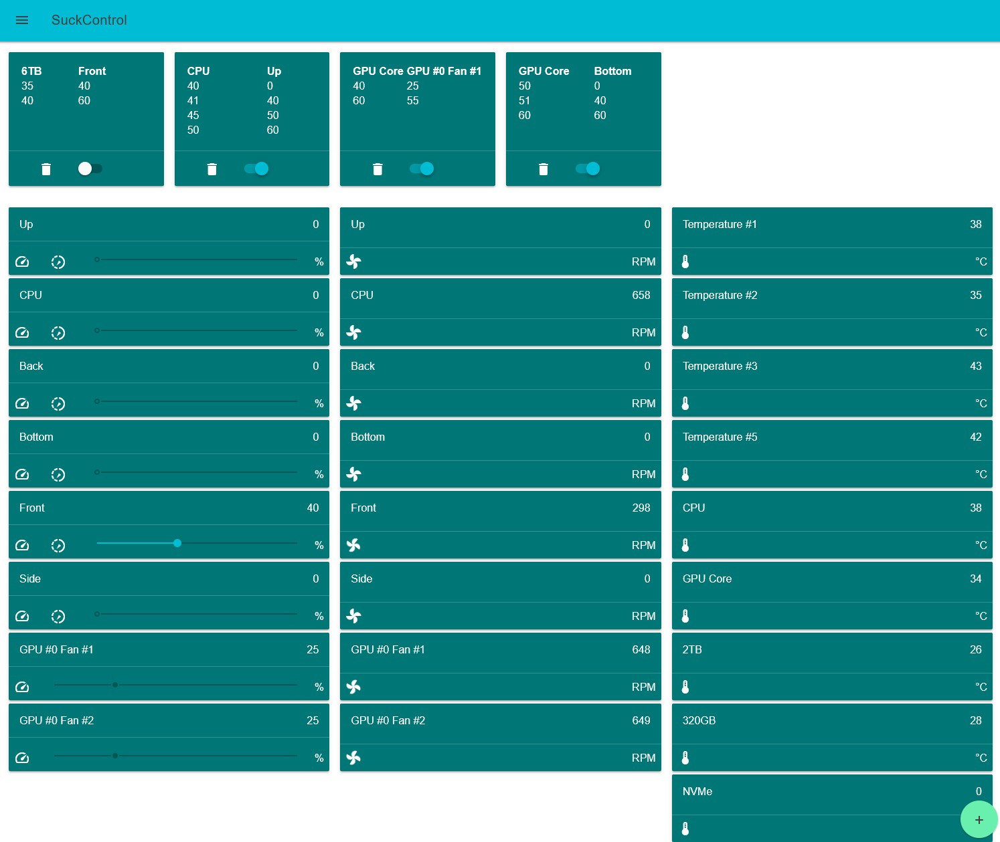

# SuckControl

## Description
Automatic control of any fan (*which is supported by your motherboard or graphics card*) depending on any temperature sensor.  
Built on [LibreHardwareMonitorLib](https://github.com/LibreHardwareMonitor/LibreHardwareMonitor). Check it, to see what is possible with your hardware.

## Features
* Define rules (curves) for every single fan with any temperature sensor
  * If your BIOS allows to control the fan, SuckControl can, too
  * All NVIDIA GPUs should be supported
* Test the loudness or cooling with the sliders
* Monitor the temperatures
* No need to restart after adding a new rule

## Usage
* Run `SuckControl.exe`, a tray-icon appears, double-click it
  * Windows will complain about it, read [here](https://stackoverflow.com/questions/54733909/windows-defender-alert-users-from-my-pyinstaller-exe)
* You should *identify and* name all the sensors you want to use
  * Click on the names to rename
    * Avoid naming two sensors of the same type exactly the same
    * [LibreHardwareMonitor](https://github.com/LibreHardwareMonitor/LibreHardwareMonitor) could help identify
* Test the loudness and/or cooling of the fans with the sliders
  * Slider positions aren't saved
* Click on the + Button to add a new rule
  * Choose one temperature sensor, on which the following fans should depend on
  * Choose at least one fan
    * If you select more than one, all selected fans will be set to the same speed
  * Enter the temperature value and the speed value
    * You need to go from low to high, the next values can't be lower than the previous ones
    * The value between two points is calculated automatically
  * Click on Save and go back to the main view

### Important Notes
* You can make SuckControl autostart with the task scheduler of Windows.
* Sliders of controls are disabled if the controls are in an enabled rule
* Slider position/value isn't saved. That's only for testing purposes
* Changes in the config.json are only active after a restart of SuckControl
* Rules show only one fan, not all associated with the rule
* AMD Radeon 5000 and newer can't be controlled by LHM

### Artemis
* [Artemis](https://artemis-rgb.com/) is a unified RGB platform
* SuckControl can send hardware monitoring data to Artemis, for RGB effects
  * The [json plugin](https://github.com/Cheerpipe/Artemis.Plugins.Public/tree/master/src/Modules/Artemis.Plugins.Modules.Json) of @Cheepipe is required
  * You can download it from the actions tab
* Activate the switch in the menu under "Artemis" (only, if you use Artemis and have the plugin installed)

## Building
* After cloning and checkout, `pip -r requirements.txt`
* Get `LibreHardwareMonitorLib.dll` and `HidSharp.dll` from LibreHardwareMonitor
* Get [NvAPIWrapper.dll](https://github.com/falahati/NvAPIWrapper/)
* Get Material Design Lite from getmdl.io
* Get [dialog-polyfill](https://cdnjs.cloudflare.com/ajax/libs/dialog-polyfill/0.5.6/dialog-polyfill.min.js)
* Install PyInstaller `pip install PyInstaller`
* Run PyInstaller with: `--name SuckControl --icon html/favicon.ico --clean -w -F --uac-admin --noupx -r build/suckcontrol/suckcontrol.exe.manifest,1 --add-data LibreHardwareMonitorLib.dll;. --add-data HidSharp.dll;. --add-data NvAPIWrapper.dll;. --add-data html;html --hidden-import pkg_resources.py2_warn --exclude win32com suckcontrol.py`
